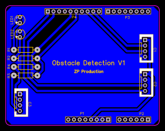
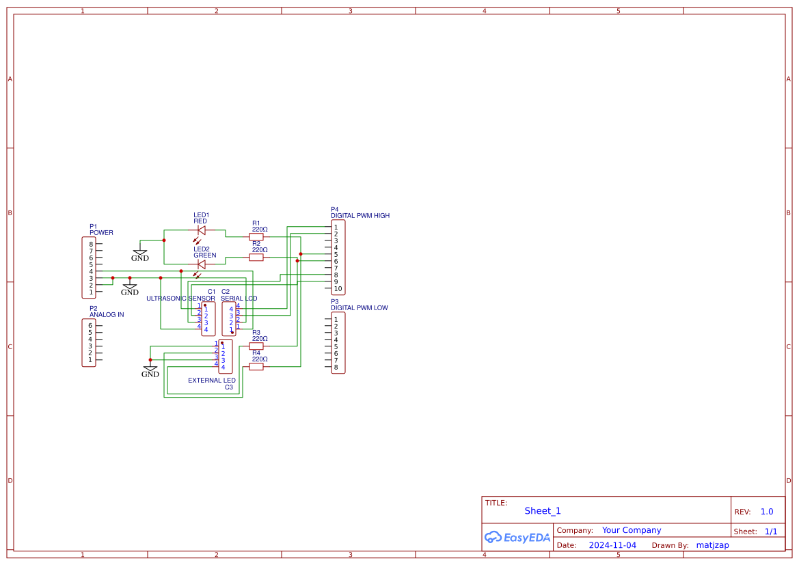
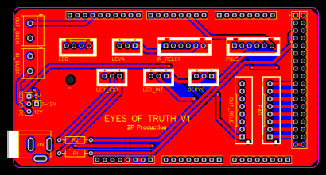
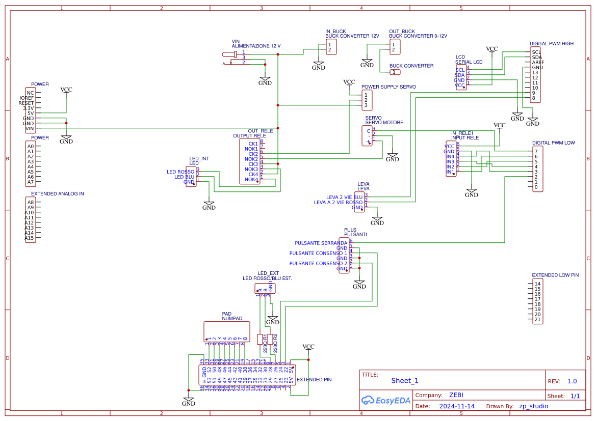
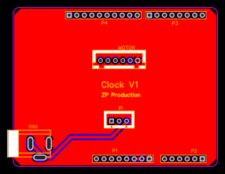
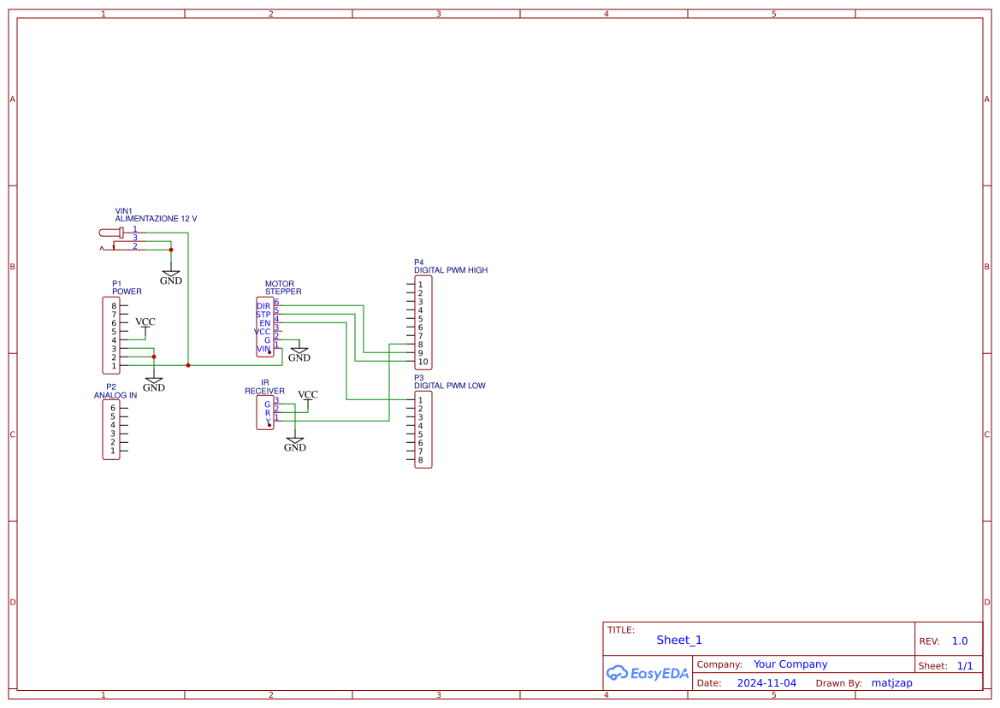
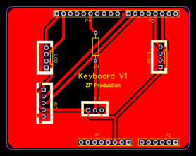
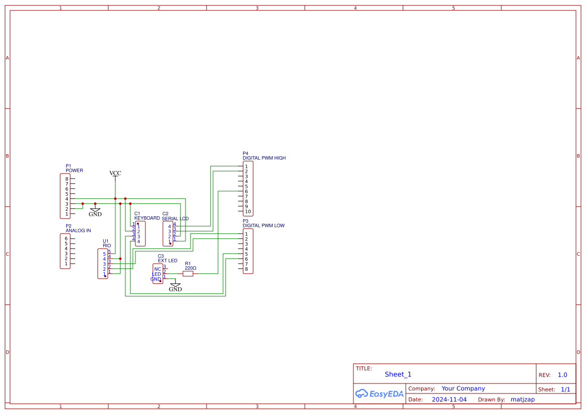

# Arduino Escape Room – *L'Ufficio dello Scienziato*

[](https://www.arduino.cc/) [](https://easyeda.com/)  
An interactive Arduino-based escape room featuring real-time puzzles, sensors, actuators, and custom-designed PCBs to create an immersive technological challenge.

---

## 🧠 About the Project

**L'Ufficio dello Scienziato** ("The Scientist’s Office") is a complete real-world escape room designed around Arduino electronics and fully custom puzzles.  
Participants must solve complex electronic-based challenges by interacting with **real sensors**, **actuators**, and **programmed puzzles**, all embedded inside a futuristic laboratory environment.

Each puzzle integrates custom-built electronic circuits and PCBs designed using **EasyEDA**, ensuring reliable, modular, and professional-grade performance.  
Creating custom PCBs allowed for **efficient wiring**, **increased robustness**, and **scalable designs**, which are fundamental in embedded interactive systems.

---

## 🗂 Project Structure

```
📦 Arduino-Escape-Room/
├── 📁 Bolobox/
│   ├── 🧩 Bolobox.ino
│   ├── 🖼️ Bolobox_PCB.png
│   ├── 🖼️ Bolobox_Schematic.png
├── 📁 IR_Clock/
│   ├── 🧩 IR_Clock.ino
│   ├── 🖼️ Clock_PCB.png
│   ├── 🖼️ Clock_Schematic.png
├── 📁 Keyboard/
│   ├── 🧩 Keyboard.ino
│   ├── 🖼️ Keyboard_PCB.png
│   ├── 🖼️ Keyboard_Schematic.png
├── 📁 ObstacleDetection/
│   ├── 🧩 ObstacleDetection.ino
│   ├── 🖼️ ObstacleDetection_PCB.png
│   ├── 🖼️ ObstacleDetection_Schematic.png
├── 📘 Escape.pdf
├── 📄 README.md
```

---

## 🎮 Room Scenario

> *"Four daring investigators are trapped inside the laboratory of a visionary — but dangerously eccentric — scientist. Surrounded by futuristic machines, hidden clues, and high-tech devices, they must solve intricate puzzles to uncover the truth... and escape before time runs out."*

Each solved puzzle brings players closer to unveiling the secrets buried deep within the scientist’s mind.

---

## 🔥 Puzzle Descriptions

---

### 🧩 Puzzle 1: **Scatole Enigmatiche del Genio** (The Genius' Mysterious Boxes)

- **Hardware**:
  - Ultrasonic sensors (HC-SR04)
  - RGB LEDs
  - LCD Displays
  - Arduino UNO
- **Objective**:
  - Players must clear obstacles detected by four smart boxes.
  - Each box, when cleared, reveals part of a mathematical equation displayed on an LCD screen.
  - Solving the full 4-variable system provides a numeric code essential for the next puzzle.

🔧 Related Files:  
[`ObstacleDetection/ObstacleDetection.ino`](./ObstacleDetection/ObstacleDetection.ino)

📸 PCB and Schematic:
<p align="center">
  
  
</p>

---

### 🧩 Puzzle 2: **Gli Occhi della Verità** (The Eyes of Truth)

- **Hardware**:
  - Servo motors
  - Push buttons
  - RGB LEDs
  - LCD Display
  - Arduino MEGA
- **Objective**:
  - Players must input the code retrieved from Puzzle 1 into a keypad to unlock a mechanical box.
  - Two players must simultaneously press buttons mounted on room walls, activating red LEDs that illuminate a hidden message.
  - A third player must open mechanical "eyes" (servo-controlled shutters) to reveal this hidden clue.
  - Successful teamwork switches the LEDs from red to blue, unveiling a second hidden message containing the final code needed.
  - If players fail to maintain button pressure, the system resets, turning off lights and closing the eyes, requiring players to retry.

🔧 Related Files:  
[`Bolobox/Bolobox.ino`](./Bolobox/Bolobox.ino)

📸 PCB and Schematic:
<p align="center">
  
  
</p>

---

### 🧩 Puzzle 3: **Il Cifratempo** (The Cipher Time)

- **Hardware**:
  - Stepper motor
  - IR Receiver
  - Arduino Nano
- **Objective**:
  - Players must operate a suspended wall clock controlled via a Sony IR remote.
  - Among several misleading buttons, only the correct remote button (hidden clue: a camera icon) triggers a precise sequence of clock hand movements.
  - Players must recognize a specific time pattern from the clock.
  - Using a Caesar cipher decoding book provided in the room, players translate the numerical sequence into a keyword.

🔧 Related Files:  
[`IR_Clock/IR_Clock.ino`](./IR_Clock/IR_Clock.ino)

📸 PCB and Schematic:
<p align="center">
  
  
</p>

---

### 🧩 Puzzle 4: **La Tastiera del Destino** (The Destiny Keyboard)

- **Hardware**:
  - Modified PS2 Keyboard
  - LCD Display
  - Solenoid Lock (Elettroserratura)
  - Arduino Nano

- **Objective**:
  - Players receive a code drawn by the **DIY Robot** on a whiteboard (hidden in the previous step).
  - They must type the correct sequence into a modified Arduino-controlled PS2 keyboard.
  - As players type, feedback is provided through the LCD display.
  - Entering the correct combination triggers an electronic solenoid lock, physically releasing the final key to exit the room.

🔧 Related Files:  
[`Keyboard/Keyboard.ino`](./Keyboard/Keyboard.ino)

📸 PCB and Schematic:
<p align="center">
  
  
</p>

---

## 🛠 Hardware & Tools Used

- **Arduino UNO / MEGA / Nano Boards**
- **HC-SR04 Ultrasonic Sensors**
- **LCD Displays 16x2**
- **RGB LEDs and Standard LEDs**
- **Servo Motors and Stepper Motors**
- **Sony Remote Control + IR Receiver**
- **PS2 Keyboard modified**
- **Solenoid Lock (Elettroserratura)**
- **Custom PCB Design with EasyEDA**

---

## 🧪 Key Learning Outcomes

- Embedded system design for real-world game experiences.
- PCB optimization for high-reliability setups.
- Synchronized real-time control between multiple players.
- Application of IR communication, keypad scanning, and motor control.
- Interactive storytelling using electronics.

---

## 📅 Year

2024/2025

---

## 👨‍🎓 Authors

- Andrea Perna  
- Mattia Zappalà

📧 and.perna99@gmail.com  
📧 matty.zapp.99.mz@gmail.com

---

## 📎 Resources

- 📘 [Escape.pdf](./Escape.pdf) – Full room and puzzles description
- 🛠 Arduino Puzzle Codes (`*.ino`)
- 📷 PCB Layouts and Electronic Schematics (EasyEDA)

---

## 📜 License

All rights reserved. Educational and demonstrative use only.

---
