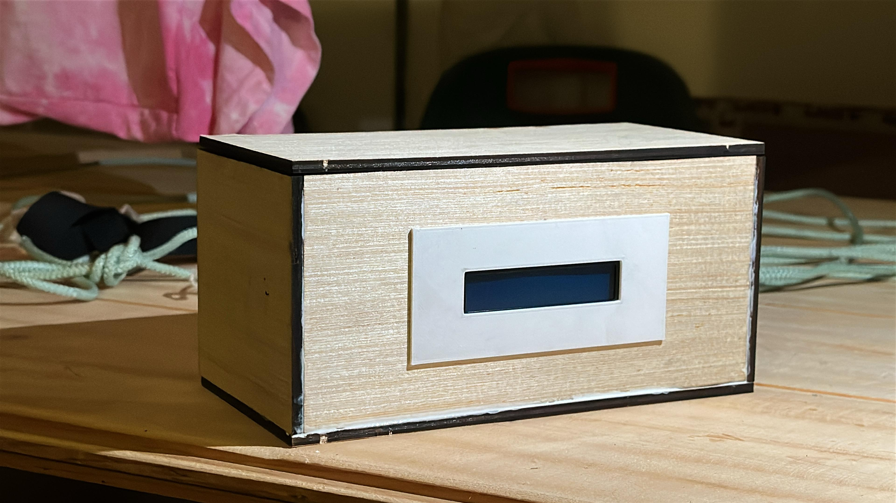
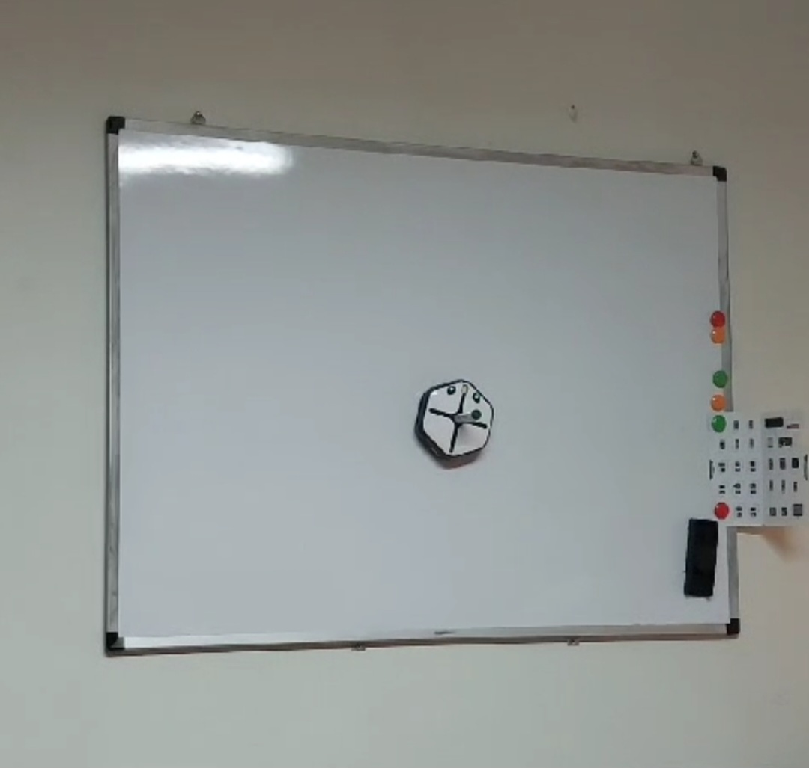
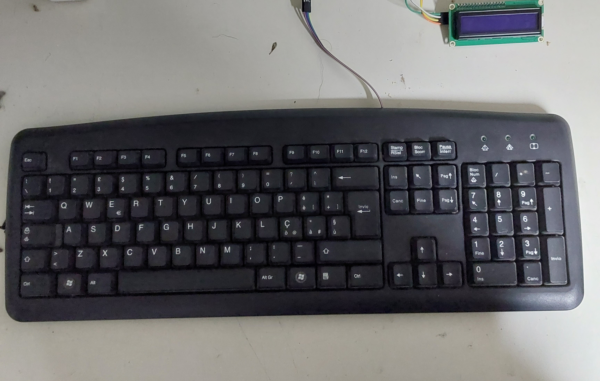

# Arduino Escape Room – *L'Ufficio dello Scienziato*

[](https://www.arduino.cc/) 
An interactive Arduino-based escape room featuring real-time puzzles, sensors, actuators, and custom-designed PCBs to create an immersive technological challenge.

---

## 🧠 About the Project

**L'Ufficio dello Scienziato** ("The Scientist’s Office") is a complete real-world escape room designed around Arduino electronics and fully custom puzzles.  
Participants must solve complex electronic-based challenges by interacting with **real sensors**, **actuators**, and **programmed puzzles**, all embedded inside a futuristic laboratory environment.  
Each puzzle integrates custom-built electronic circuits and PCBs designed using **EasyEDA**, ensuring reliable, modular, and professional-grade performance.  
Creating custom PCBs allowed for **efficient wiring**, **increased robustness**, and **scalable designs**, which are fundamental in embedded interactive systems.

---

## 🗂 Project Structure

```
📦 Arduino-Escape-Room/
├ 📁 Bolobox/
│  ├ 🧩 Bolobox.ino
│  ├ 🖼️ Bolobox_PCB.png
│  ├ 🖼️ Bolobox_Schematic.png
├ 📁 IR_Clock/
│  ├ 🧩 IR_Clock.ino
│  ├ 🖼️ Clock_PCB.png
│  ├ 🖼️ Clock_Schematic.png
├ 📁 Keyboard/
│  ├ 🧩 Keyboard.ino
│  ├ 🖼️ Keyboard_PCB.png
│  ├ 🖼️ Keyboard_Schematic.png
│  ├ 🖼️ DrawingRobot.jpg
│  ├ 🖼️ PS2Keyboard.jpg
├ 📁 ObstacleDetection/
│  ├ 🧩 ObstacleDetection.ino
│  ├ 🖼️ ObstacleDetection_PCB.png
│  ├ 🖼️ ObstacleDetection_Schematic.png
│  ├ 🖼️ Obstacle_box.jpg
├ 📘 Escape.pdf
├ 📄 README.md
```

---

## 🎮 Room Scenario

> *"Four daring investigators are trapped inside the laboratory of a visionary — but dangerously eccentric — scientist. Surrounded by futuristic machines, hidden clues, and high-tech devices, they must solve intricate puzzles to uncover the truth... and escape before time runs out."*

Each solved puzzle brings players closer to unveiling the secrets buried deep within the scientist’s mind.

---

## 🔥 Puzzle Descriptions

---

### 🧩 Puzzle 1: **Scatole Enigmatiche del Genio** (The Genius' Mysterious Boxes)

- **Hardware**:
  - Ultrasonic sensors (HC-SR04)
  - RGB LEDs
  - LCD Displays
  - Arduino UNO
- **Objective**:
  - Players must clear obstacles detected by four smart boxes.
  - Each box, when cleared, reveals part of a mathematical equation displayed on an LCD screen.
  - Solving the full 4-variable system provides a numeric code essential for the next puzzle.

🔧 Related Files:  
[`ObstacleDetection/ObstacleDetection.ino`](./ObstacleDetection/ObstacleDetection.ino)

📸 PCB and Schematic:
<p align="center">
  
  
</p>

📸 Real-world Implementation:
<p align="center">
  
</p>
---

### 🧩 Puzzle 2: **Gli Occhi della Verità** (The Eyes of Truth)

- **Hardware**:
  - Servo motors
  - Push buttons
  - RGB LEDs
  - LCD Display
  - Arduino MEGA
- **Objective**:
  - Players must input the code retrieved from Puzzle 1 into a keypad to unlock a mechanical box.
  - Two players must simultaneously press wall buttons to reveal a red-lit hidden message.
  - A third player operates mechanical "eyes" (servo-controlled shutters) to expose the message.
  - After correctly solving the first clue, the system switches LEDs to blue, unveiling the final hidden solution.

🔧 Related Files:  
[`Bolobox/Bolobox.ino`](./Bolobox/Bolobox.ino)

📸 PCB and Schematic:
<p align="center">
  
  
</p>

---

### 🧩 Puzzle 3: **Il Cifratempo** (The Cipher Time)

- **Hardware**:
  - 28BYJ-48 Stepper Motor + ULN2003 driver board
  - IR Receiver
  - Arduino Nano
- **Objective**:
  - Players interact with a modified analog clock, whose hands are motor-controlled via an IR remote.
  - Only by pressing the correct remote button (hinted via hidden symbols) does the clock perform a meaningful movement.
  - Different buttons trigger distinct trajectories:  
    ➔ **Sigmoid trajectory** for smooth accelerations  
    ➔ **Trapezoidal trajectory** for constant speed intervals
  - Players must recognize the resulting time pattern and decode it using a Caesar cipher, leading to a hidden keyword.

🔧 Related Files:  
[`IR_Clock/IR_Clock.ino`](./IR_Clock/IR_Clock.ino)

📸 PCB and Schematic:
<p align="center">
  
  
</p>

**🛠 Motor Used**:  
- [28BYJ-48 5V Stepper Motor + ULN2003 Driver Board](https://www.amazon.it/dp/B09KLJRL53/ref=sspa_dk_detail_6?psc=1)  
- Compact, precise, and ideal for synchronized clock hand control using Arduino.

---

### 🧩 Puzzle 4: **La Tastiera del Destino** (The Destiny Keyboard)

- **Hardware**:
  - Modified PS2 Keyboard
  - LCD Display
  - Solenoid Lock (Elettroserratura)
  - Arduino Nano
- **Objective**:
  - After receiving a code drawn by the DIY Robot on the whiteboard, players must input the correct sequence into a modified Arduino-controlled PS2 keyboard.
  - The LCD provides live feedback while typing.
  - Correctly entering the password triggers a solenoid lock to release the physical key needed to exit.

🔧 Related Files:  
[`Keyboard/Keyboard.ino`](./Keyboard/Keyboard.ino)

📸 PCB and Schematic:
<p align="center">
  
  
</p>

📸 Real-world Implementation:
<p align="center">
  
  
</p>

---

## 🛠 Hardware & Tools Used

- **Arduino UNO / MEGA / Nano Boards**
- **HC-SR04 Ultrasonic Sensors**
- **LCD Displays 16x2**
- **RGB LEDs and Standard LEDs**
- **Servo Motors and 28BYJ-48 Stepper Motors**
- **ULN2003 Driver Boards**
- **Sony Remote Control + IR Receiver Modules**
- **Modified PS2 Keyboards**
- **Solenoid Locks (Elettroserratura)**
- **Custom PCB Designs with EasyEDA**

---

## 🧪 Key Learning Outcomes

- Full-stack embedded system design for immersive experiences.
- Real-time multi-sensor interaction and synchronization.
- PCB design for robust embedded control using EasyEDA.
- Wireless IR communication, programmable trajectory control, and real-time feedback systems.
- Engineering complex interactive storylines through electronics.

---

## 📅 Year

2024/2025

---

## 👨‍🎓 Authors

- Andrea Perna  
- Mattia Zappalà

📧 and.perna99@gmail.com  
📧 matty.zapp.99.mz@gmail.com

---

## 📎 Resources

- 📘 [Escape.pdf](./Escape.pdf) – Room and puzzle descriptions
- 🛠 Arduino Puzzle Codes (`*.ino`)
- 📷 PCB Layouts and Electronic Schematics (EasyEDA)

---

## 📜 License

All rights reserved. Educational and demonstrative use only.

---
